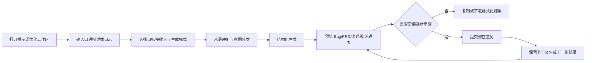

# DevPrompt Pro 集成实现方案

## 1. 方案定位

本文档说明如何将 DevPrompt Pro 集成到当前 Code Reviewer 应用。目标是新增一个面向研发沟通的“自然语言需求结构化”工作区：用户输入口语化需求、Bug 描述或日志，选择目标接收人，系统输出可直接用于研发协作的结构化内容。

本功能与代码审查属于两个不同的业务域：

- 代码审查的输入是代码变更，输出是带文件和行号证据的 Finding；
- DevPrompt Pro 的输入是自然语言，输出是问题现象、技术本质、解决方案、术语映射和沟通摘要。

因此不复用 `ReviewTask`、`ReviewState`、FindingGate 或现有 LangGraph 审查图作为业务模型。复用范围限定为 LLM 配置与调用能力、FastAPI 应用生命周期、React 路由和现有 UI 基础组件。

## 2. 当前代码基础与约束

当前项目已经具备以下可复用能力：

| 现有能力 | 位置 | 集成方式 |
| --- | --- | --- |
| OpenAI 兼容协议的 LLM 调用 | `backend/app/engine/llm.py` | 提取为公共调用依赖，由提示词服务调用；不复用 Reviewer 的审查提示词和工具循环 |
| LLM 配置 | `backend/app/config.py` | 复用现有 API Key、Base URL、模型配置，新增提示词专用的输入长度、输出长度和会话限制配置 |
| FastAPI 路由注册 | `backend/app/main.py` | 新增独立的 `prompts` 路由，不改写审查路由 |
| React 路由与布局 | `frontend/src/App.tsx`、`frontend/src/components/Layout.tsx` | 新增 `/prompts` 页面和主导航入口 |
| Tailwind、Card、Button 等组件 | `frontend/src/components/ui/` | 复用现有视觉基础，不新增独立 UI 框架 |
| SQLite/SQLAlchemy | `backend/app/models/` | 仅用于团队词库；用户原始输入和生成结果默认不持久化 |

需要在实现前保留以下边界：

1. 当前 `LLMProvider` 实际使用 DeepSeek 的 OpenAI 兼容接口，不能直接宣称已经支持原生 OpenAI、Claude、Gemini 和 DeepSeek 四类供应商。第一阶段按当前兼容接口实现，后续再增加供应商适配器。
2. 当前 LLM 调用是非流式 `chat`，因此“首字延迟小于 800ms”暂时不能作为已实现指标。第一阶段先交付完整结果生成和清晰的加载状态，流式响应单独作为后续阶段。
3. 当前应用没有用户、团队和权限模型。第一阶段的团队词库只能定义为本机工作区词库，不能在接口中伪装成多租户团队词库。
4. 需求文档中的“截图描述”第一阶段按文本输入处理；真正的图片上传、图片解析和多模态模型调用另行实施。

## 3. 目标用户流程



标准模式在一次请求中返回完整结果。审查模式创建一个短生命周期的内存会话，每轮只接收用户的确认或修正意见，最多支持 3 轮；会话过期或服务重启后不保证恢复。

## 4. 业务模型

### 4.1 输入模型

```text
PromptOptimizeRequest
  content: string                 # 原始描述，必填
  persona: general|frontend|backend|ui|qa|architecture
  mode: instant|review
  glossary_enabled: boolean
```

约束建议如下：

- `content` 长度限制为 1～12,000 个字符，服务端再次校验；空白输入拒绝，短句允许直接进入结构化生成，由模型通过 `checks` 和 `assumptions` 表达信息不足；
- 允许粘贴报错日志、需求描述和文本化截图说明；
- 不接受任意文件路径、代码执行参数或工具调用参数；
- `persona` 默认 `general`，不能将目标岗位直接当作事实写入输出；
- 未明确的 Bug/Feature 类型由模型标记为 `unknown`，不强制猜测。

### 4.2 输出模型

服务端要求模型只返回 JSON，并使用 Pydantic 校验后再返回前端。建议结构如下：

```json
{
  "classification": {
    "type": "bug | feature | ux | architecture | unknown",
    "confidence": 0.82,
    "reason": "分类依据"
  },
  "problem_phenomenon": "用户可观察到的现象",
  "technical_essence": "经过约束的技术本质",
  "solution": ["可执行建议一", "可执行建议二"],
  "bug_view": "面向缺陷处理的结构化描述",
  "prd_view": "面向需求评审的结构化描述",
  "team_message": "一句话沟通版",
  "term_mappings": [
    {
      "original": "不够丝滑",
      "professional": "响应跟手度不足或动画过渡生硬",
      "reason": "说明映射依据"
    }
  ],
  "assumptions": ["需要用户确认的前提"],
  "checks": ["输入中无法确认的事项"]
}
```

`checks` 和 `assumptions` 用于表达不确定性，不应被渲染为 Bug Finding。输出缺少必填字段、JSON 无法解析或模型返回空内容时，服务端返回明确错误，不将失败结果转换为空报告。

### 4.3 审查会话模型

审查模式使用短生命周期的 `PromptSession`：

```text
session_id
mode
persona
turn
max_turns = 3
messages                     # 仅保存在进程内，限制总长度
latest_result
created_at
expires_at
```

会话存储采用带 TTL 和容量上限的内存仓库，避免把业务文本写入 SQLite。服务重启、过期、超过轮次或超过上下文长度时，接口返回可理解的会话失效错误，并提示重新生成。

### 4.4 团队词库模型

团队词库是有意保存的配置数据，可以新增 SQLite 表 `glossary_terms`：

| 字段 | 说明 |
| --- | --- |
| `id` | UUID 主键 |
| `source_phrase` | 口语或旧称 |
| `preferred_term` | 团队规范名称 |
| `description` | 术语解释和适用边界 |
| `enabled` | 是否参与生成 |
| `created_at` | 创建时间 |
| `updated_at` | 更新时间 |

第一阶段不增加 `team_id` 或用户权限字段，界面明确标识为“本机工作区词库”。后续建立认证和团队模型后，再迁移为按团队隔离的数据。

## 5. 后端模块设计

建议新增以下模块：

```text
backend/app/
├── api/prompts.py                     # 提示词优化与会话 API
├── models/glossary.py                 # 词库 ORM
├── services/prompt_optimizer.py       # 编排输入、映射、LLM、校验
├── services/prompt_session.py         # TTL 会话仓库
├── services/glossary_service.py       # 词库查询与版本快照
└── engine/prompt/
    ├── __init__.py
    ├── mapping.py                      # 内置术语映射与候选词
    ├── schemas.py                      # LLM 输出和 API 模型
    ├── prompt_builder.py               # Jinja 模板输入组装
    └── exporters.py                    # Markdown/Jira/Issue 文本格式化
backend/prompts/devprompt_pro.j2       # 系统提示词模板
backend/tests/test_prompt_*.py         # 单元与接口回归测试
```

### 5.1 提示词服务调用链

`PromptOptimizer` 负责以下顺序：

1. 校验输入长度、目标岗位和模式；
2. 对输入执行敏感信息和控制字符的基础处理，不记录原文日志；
3. 查询启用的本机词库；
4. 使用内置 `TerminologyMapper` 产生候选术语映射；
5. 将原文、岗位、候选映射和输出契约放入明确的数据分隔区，调用公共 LLM 客户端；
6. 解析 JSON，使用 Pydantic 校验，缺少字段时执行一次“格式修复”请求；
7. 对 `term_mappings`、`checks`、`assumptions` 做长度和数量限制；
8. 返回结构化结果以及非敏感的元信息，如耗时、模型名和当前轮次。

`TerminologyMapper` 不应只做无条件字符串替换。它先给出候选映射，最终是否采用由模型结合上下文决定；团队词库优先级高于内置词库，但词库内容必须作为数据传入，不能被当作系统指令执行。

### 5.2 API 设计

建议新增接口：

| 方法 | 路径 | 作用 |
| --- | --- | --- |
| `POST` | `/api/prompts/optimize` | 标准模式或审查模式的首次生成 |
| `POST` | `/api/prompts/sessions/{id}/turns` | 在审查会话中提交确认或修正意见 |
| `GET` | `/api/prompts/sessions/{id}` | 获取当前会话状态；只返回当前结果，不返回超出限制的原始历史 |
| `DELETE` | `/api/prompts/sessions/{id}` | 主动清除内存会话 |
| `GET` | `/api/glossary/terms` | 查询本机词库 |
| `POST` | `/api/glossary/terms` | 新增词条 |
| `PATCH` | `/api/glossary/terms/{id}` | 修改词条 |
| `DELETE` | `/api/glossary/terms/{id}` | 删除词条 |

首次生成请求示例：

```json
{
  "content": "点击切换后看起来还是选中，刷新页面又恢复了",
  "persona": "frontend",
  "mode": "review",
  "glossary_enabled": true
}
```

首次响应包含 `result`、`turn`、`session_id`（仅审查模式）和 `expires_at`。标准模式不创建会话。错误使用统一的 FastAPI 错误格式，至少区分输入校验失败、会话失效、LLM 调用失败和输出契约失败。

### 5.3 与现有 LLM 模块的关系

不直接从提示词服务调用 Reviewer，也不把 DevPrompt Pro 模板加入 `security.j2`、`performance.j2` 或 `style.j2`。建议将 `LLMProvider.chat` 中与供应商无关的请求能力抽出为公共接口，保留现有 Reviewer 的行为不变：

```text
LLMClient.chat(messages, response_format=...)
  ├── Reviewer 调用：工具循环、Finding JSON
  └── PromptOptimizer 调用：单轮结构化 JSON
```

第一阶段继续使用现有 OpenAI 兼容客户端和 DeepSeek 配置。需要真正支持多供应商时，再增加 `LLMProviderFactory` 或适配器，并为每种供应商分别验证 JSON 输出、超时和错误格式。

## 6. 前端实现方案

### 6.1 路由与页面

新增：

- `frontend/src/pages/PromptWorkbench.tsx`：页面容器和请求状态；
- `frontend/src/components/prompt/PromptInputPanel.tsx`：文本输入、岗位和模式选择；
- `frontend/src/components/prompt/PromptOutputPanel.tsx`：结构化结果 Tab；
- `frontend/src/components/prompt/PromptReviewStepper.tsx`：审查模式的轮次和反馈输入；
- `frontend/src/components/prompt/GlossaryPanel.tsx`：本机词库维护；
- `frontend/src/api/prompts.ts`：API 客户端；
- `frontend/src/types/prompt.ts`：请求、响应和词库类型。

在 `App.tsx` 增加 `/prompts` 路由，在 `Layout.tsx` 增加“提示词优化”入口。初始页面采用左右布局：左侧输入与配置，右侧结果预览；窄屏改为上下布局。

### 6.2 输出与导出

结构化结果至少包含以下 Tab：

1. 结构化结果：问题现象、技术本质、解决方案；
2. Bug/需求视角：根据 `classification.type` 展示相关内容；
3. 团队沟通版：突出一句话摘要；
4. 术语对照：展示原始表达、专业术语和映射依据。

Markdown、Jira 文本和 GitHub Issue 模板由前端或共享格式化函数根据已校验的 JSON 确定性生成，不再次调用 LLM。第一阶段提供复制和下载，不接入 Jira/GitHub 的账号授权、远程创建或自动提交。

### 6.3 状态与错误处理

- 标准模式显示输入校验、生成中、成功和失败四种状态；
- 审查模式显示当前轮次、剩余轮次、会话过期时间和重新开始入口；
- `checks` 和 `assumptions` 使用诊断样式，不使用代码审查页面的风险告警样式；
- 生成失败时保留用户输入，不清空编辑器；
- 复制成功、下载成功和词库保存成功使用轻量反馈，不阻断主内容；
- 不把模型原始输出完整写入浏览器控制台或后端普通日志。

## 7. 分阶段实施

### 阶段一：可用 MVP（P0）

目标是闭合“输入—生成—查看—复制”的主链路，并支持 3 轮审查模式。

- 建立 Prompt 领域 Schema、内置术语映射和输出校验；
- 新增同步 `POST /api/prompts/optimize`；
- 新增内存 TTL 会话和审查模式轮次接口；
- 复用现有 LLM 配置，增加超时、输入长度和会话容量配置；
- 新增 `/prompts` 页面、岗位选择、两种模式和结构化 Tab；
- 实现 Markdown/Jira/Issue 文本的本地复制和下载；
- 补充服务、API、会话和导出测试；
- 明确页面提示：刷新或服务重启后审查会话可能失效。

### 阶段二：词库与生成体验（P1）

- 增加 `glossary_terms` 表和 CRUD API；
- 增加本机词库维护面板和启用/停用操作；
- 将词库版本快照写入一次生成的非敏感元信息，便于复现规则；
- 为 LLM 客户端增加真正的流式接口和 SSE 响应；
- 将前端输出区改为增量渲染，同时保留最终 JSON 校验；
- 用固定样例集测量首字延迟、完整生成耗时、字段完整率和映射质量。

### 阶段三：平台能力（P2）

- 增加统一供应商适配器，分别支持已验证的模型协议；
- 以认证和团队模型为前提，将本机词库迁移为团队隔离词库；
- 增加图片上传、图片安全检查和多模态输入；
- 增加全局快捷键，需要在 Electron 主进程、preload 和前端桥接层共同实现；
- 在获得外部授权后再实现 Jira/GitHub 的直接创建，不把导出模板与远程写入混为一谈；
- 增加不包含原文的聚合使用指标和失败原因统计。

## 8. 验证方案

### 8.1 后端验证

至少覆盖：

1. 空输入、超长输入、非法岗位和非法模式被拒绝；
2. 标准模式返回四类核心结构，模型缺字段时不会返回伪成功结果；
3. Bug、Feature、UX、架构和无法判断的样例分类符合契约；
4. 内置词库和本机词库都能传入提示词，且词库内容不会覆盖系统规则；
5. 审查会话最多 3 轮，过期、未知会话和超长历史均返回明确错误；
6. LLM 超时、空响应、非法 JSON 和格式修复失败均能区分；
7. 导出文本由同一结构化结果稳定生成；
8. 普通日志、错误日志和数据库中不出现用户原始输入与生成全文；
9. 现有代码审查测试全部保持通过。

### 8.2 前端验证

- `npm.cmd run build`；
- `npm.cmd run lint`；
- 手工验证桌面宽屏、窄屏、空状态、失败重试、复制下载和审查三轮流程；
- 确认从提示词页面返回仓库页面、刷新路由和后端静态托管模式均正常；
- 如果进入 Electron 快捷键阶段，再执行桌面端构建和测试。

### 8.3 质量指标

不要直接把 PRD 中的“术语命中率大于 90%”当作上线前的单一结论。先建立 20～30 条固定中文样例，分别记录：

- 必填字段完整率；
- 分类与目标岗位的人工复核结果；
- 术语映射可接受率；
- 无法确认内容被标记为 `checks` 或 `assumptions` 的比例；
- JSON 解析失败率、格式修复率和 LLM 超时率；
- P50/P95 首次响应和完整响应耗时。

当前非流式客户端无法证明首字延迟指标，阶段二完成 SSE 后再测量该指标。用户是否复制、修改或关闭结果只能作为行为数据，不能直接推导生成内容的准确性。

## 9. 实施顺序与文件变更清单

建议按以下顺序实施，每一步都保持应用可构建：

1. 新增 Prompt Schema、映射器、模板和假 LLM 测试；
2. 新增服务、会话仓库和 API，先用接口测试闭合后端；
3. 注册路由并补充 SQLite 词库表的兼容初始化逻辑；
4. 新增前端类型、API 客户端和工作区页面；
5. 接入导航、导出和审查模式交互；
6. 执行后端测试、语法检查、前端构建与 lint；
7. 再决定是否进入词库持久化、SSE、图片和快捷键阶段。

预期首阶段修改范围：

```text
新增 backend/app/api/prompts.py
新增 backend/app/engine/prompt/
新增 backend/app/services/prompt_optimizer.py
新增 backend/app/services/prompt_session.py
新增 backend/prompts/devprompt_pro.j2
新增 backend/tests/test_prompt_*.py
新增 frontend/src/pages/PromptWorkbench.tsx
新增 frontend/src/components/prompt/*
新增 frontend/src/api/prompts.ts
新增 frontend/src/types/prompt.ts
修改 backend/app/main.py
修改 backend/app/config.py
修改 frontend/src/App.tsx
修改 frontend/src/components/Layout.tsx
```

实现前应重新检查工作区现有改动，尤其是 `backend/app/engine/llm.py`、`backend/app/models/*`、`frontend/src/types/index.ts` 和前端布局文件；如果这些文件仍有未提交改动，应先拆分变更边界，避免把提示词功能混入既有审查修复。

## 10. 结论

第一阶段以独立 Prompt 领域、同步结构化生成、短生命周期审查会话和本地确定性导出为交付目标。这样可以最大限度复用当前应用的 LLM、API 和 UI 基础，同时不改变代码审查的任务状态、Finding 质量门槛和报告数据结构。

流式输出、真正多供应商、图片输入、团队隔离和外部系统直写都需要额外的协议、权限或桌面能力，应在 MVP 主链路稳定并完成数据安全验证后实施。
